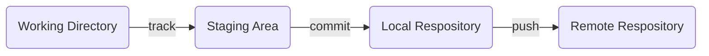
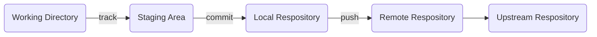

# Git/github

`git`: revision control system.

`github.com`: the off-site cloud-based backup.

##### Configure

**If you not setup the `user.email`, mostly your commits won't count as contributions.**

```shell
git config --global user.name "[name]"
git ocnfig --global user.email "[email]"
git config --list			# check git setting
```

## Git Work flow




### Create a Repository

#### From Remote Repository (GitHub)

Download a project and its entire version history.

```shell
git clone [url]
```

#### Local Repository

```shell
git init
```

### Track a File

`Git` ignores files until `add` files into staging area.

```shell
git status (-s)				# check the status of changes (-s simplified output).
git diff <filename>			# compares file in working dir with file in stage.
git add <filename/dir>		# add file/directory to stage.
git add <filename_1> <filename_2>
git add --all				# add all the files to stage.
git rm <filename>			# remove from stage, but preserve the file in working dir.
git mv <file_from> <file_to>
```

#### Ignoring Files

Create a file listing patterns to match them named `.gitignore`. 

The rules for the patterns you can put in the `.gitignore` file are as follows:

- Blank lines or lines starting with `#` are ignored.
- Standard glob patterns work, and will be applied recursively throughout the entire working tree.
- You can start patterns with a forward slash (`/`) to avoid recursivity.
- You can end patterns with a forward slash (`/`) to specify a directory.
- You can negate a pattern by starting it with an exclamation point (`!`).

#### Backtrack

```shell
git show HEAD					# show the current commit
git reset HEAD <filename>		# unstage the file, preserve its content
git checkout HEAD <filename>	# restore the file to last commit, discard the change
```

### Commit

```bash
git diff --staged			# compare staged changes to last commit
git log						# view all commits.
git commit
git commit -m "message"		# followed by a message
git commit -a 				# commit all, can skip the staging steps
```

#### Reset commit

#### Local Branch

```bash
git branch						# list all branches
git branch --merged				# 
git branch --no-merged			#
git branch <branchname>			# create new branch
git checkout <branchname>		# switching branch
git merge <brachname>			# merge the branch
git branch -d <branchname>		# delete branch
```

##### Conflict with merge

Anything that has merge conflicts and hasn’t been resolved is listed as unmerged. `commit` after merge the conflict.

### Push

```bash
git remote -v					# list all the remote respository
git remote add <shorname> <url>	# add a new remote git repository
git push <remote> <branch>
git pull						# = git fetch + git merge
```

#### Reset

```

```

#### Remote Branch

```bash
git fetch <remote>
```

## Group Project - fork



1. Fork the project
2. Create a topic branch from `master`.
3. Make some commits to improve the project.
4. Push this branch to your GitHub project.
5. Open a Pull Request on GitHub.
6. Discuss, and optionally continue committing.
7. The project owner merges or closes the Pull Request.

### Keep up with upstream

```bash
git remote add upstream <url>
git fetch upstream
git merge upstream/master
```

## Other Useful Command

### Rewrite email address

```bash
git filter-branch --commit-filter '
        if [ "$GIT_AUTHOR_EMAIL" = "schacon@localhost" ];
        then
                GIT_AUTHOR_NAME="Scott Chacon";
                GIT_AUTHOR_EMAIL="schacon@example.com";
                git commit-tree "$@";
        else
                git commit-tree "$@";
        fi' HEAD
```

