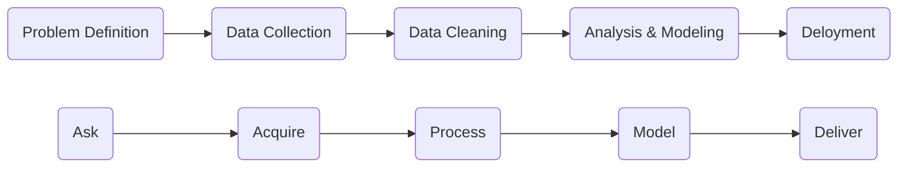

# 3.5. Machine Learning

##What is Machine Learning

###Informal definition

Learn a function from data that can generalize to predict new data.

- Learn: not explicitly program
- Function: a computer function with inputs & outputs
- Data:
- Generalize to new data:

The field of study that gives computers the ability to learn without being explicitly programmed.

###Modern definition

A computer program is said to learn from experience (E) with respect to some class of tasks (T) and performance measure (P), if its performance at tasks in T, as measured by P, improves with experience E.

*Example:*

playing checkers.

E = the experience of playing many games of checkers

T = the task of playing checkers.

P = the probability that the program will win the next game.

##Statistics VS Machine Learning

| Statistics                                                   | Machine Learning                                             |
| ------------------------------------------------------------ | ------------------------------------------------------------ |
| subfield of mathematicsatics                                 | subfield of computer science and artificial intelligence     |
| theoretical                                                  | applied                                                      |
| focuses on formalization of relationships between variables in the form of mathematical equations | focusescoding systems that can learn from data, instead of explicitly programmed instructions |
| data modeling                                                | algorithmic modeling                                         |
| data up                                                      | logic down                                                   |
| probabillistic                                               | deterministic                                                |

###Data Modeling

1. Data are generated by independent draws (i.i.d.)
2. Values of the parameters are estimated from the data
3. Model then used for information and/or prediction

###Algorithmic modeling

1. Find a function f(x) - an algorithm that operates on x to predict the responses y
2. Does not matter how data are generated
3. Only care about prediction. Informative models are just a step along the way

##Computer Science VS Machine Learning

| CS            | ML            |
| ------------- | ------------- |
| logic down    | data up       |
| deterministic | probabilistic |

##Relationship between AI, ML, DL

##Data Science Workflow

###Ask

Starting with domain experience, ask specific and meaningful questions. Define all terms precisely withing the context.

###Acquire

Do I have even have access to the relevant data?

How is the data stored?

Is the organization even collecting the right data?

###Process

Get all the data in a single location. Machine Learning needs to have in one place, usually a single Data Frame.

Understand, organize, munge, and clean.

Find labels to answer questions

###Model

Apply Statistics, Machine Learning, and Deep Learning algorithms.

**Modeling is not actually that important - Any model will be good enough for most applied settings.**

###Deliver

The goal is to add value.

Is it a report, presentation, or code?

How are the models going into production? Raw code? PMML? API?

What does the system look like when the data changes?

##Type of ML

###Supervised Learning

**Learns a mapping from data to labels.**

In supervised learning, we are given a data set and already know what our correct output should look like, having the idea that there is a relationship between the input and the output.

####Regression

In a regression problem, we are trying to predict results within a **continuous** output, meaning that we are trying to map input variables to some continuous function. 

Examples: predicts real-valued targets

- predict revenue
- predict growth rate
- predict rate of hardware breakdowns

Algorithms:

- General Linear Model
- Regression Decision Trees
- Regression Support Vector Machines
- ......

####Classification 

In a classification problem, we are instead trying to predict results in a **discrete** output. In other words, we are trying to map input variables into discrete categories.

Examples: predicts discrete categories

- Classify emails as spam
- Hotdog / Not hotdog in images
- Object identification
- Identify specific people in images

Algorithms:

- k-NN
- Naive Bayes
- Decision Trees
- Support Vector Machines (SVM)
- Logistic Regression

###Unsupervised Learning

Learns to identify commonalities in the data.

Learns the hidden (latent) structure of data.

Uses **unlabeled** data (majority of data in the world).

Unsupervised learning allows us to approach problems with little or no idea what our results should look like. We can derive structure from data where we don't necessarily know the effect of the variables.

We can derive this structure by clustering the data based on relationships among the variables in the data.

With unsupervised learning there is **no feedback** based on the prediction results.

Example:

- Clustering (k-means or Latent Dirichlet allocation (LDA))
- Dimension Reduction (PCA)
- Density estimation (kernel density estimation)
- Matrix Completion (Collaborative Filtering)
- Anomaly Detection (One Class SVM)
- Factor analysis (Exploratory Factor Analysis)

Algorithm:

- Continuous (Clustering and Dimensionality Reduction)
  - SVD
  - PCA
  - K-means
- Categorical
  - Association Analysis
    - Apriori
    - FP-Growth
  - Hidden Markov Model
  - Multiple correspondence analysis

##Components of ML

###Data

Lots of data: minimum 30-100 examples per target to make robust estimates.

####Clean data

Because ML just learns patterns, noisy data makes it hard to learn signal, models might learn the noise.

####Label data

Most algorithms assumes labels

Most labeling is done by humans

###Training

1. Start with a random guess
2. See how wrong you are (loss function)
3. Change the model to be less wrong
4. Repeat 2-3 until "done"

####Algorithms

A series of explicit and unambiguous steps to reach an outcome.

In the case of Machine Learning, the steps needed to go from raw data to predictions.

####Methodology (Models)

The end result of applying a ML algorithm.

An architecture with weights used to make predictions.

###Predictions

The goal of ML is prediction / inference.

Test your predictions on **test data**, data that you already have put to the side during training (Train / Test split). The simplest kind of generalization.

###Performance Metrics

A number that measures how good your model performs.

You want this to be a single number.

Example:

- Accuracy
- Logarithmic Loss
- True Positive / False Positive / True Negative / False Negative
- Precision / Recall / F Score
- Mean Absolute Error (MAE) / Mean Squared Error (MSE)
- …