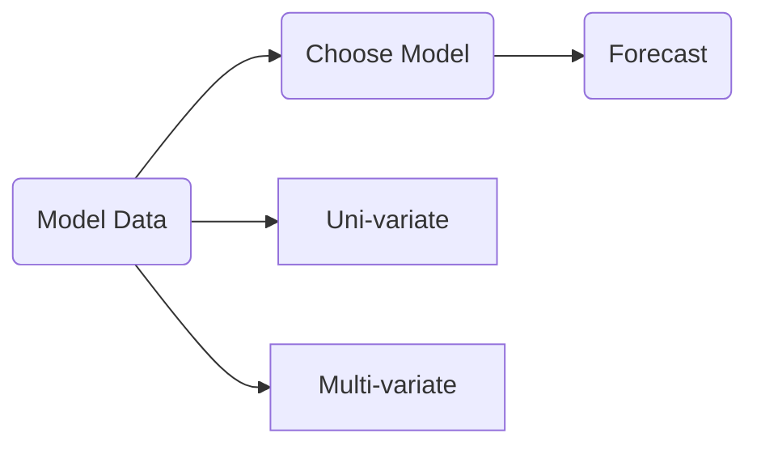

# 2.3. Time Series

<<<<<<< HEAD
A collection of data points corresponding to temporal measurements of some quantitative variables.

##Notation

${y_1, y_2, ..., y_T}$

where $y_T$ represents the $t^{th}$ observation of the variable $y$, $t = 1, 2, ..., T$.

##Visualization - time series plot

A time series is best visualized as a scatter plot of $y$ vs. $t$ with adjacent points connected by a straight line. It is clearly displays the relationship between the variable $y$ and time.

##Terminology

### Time Series Analysis

Modeling the relationship between the variable $y$ and time $t$.

###Time Series Model

Characterizing the nature of the relationship between $y_{t+1}$ and {$y_1, y_2, ..., y_t$}.

$y_{t+1}=f(y_1, y_2, ..., y_t)$

### Forecasting

Using time series model to predict the value of $y_{t+1}$ given the history {$y_1, y_2, ..., y_t$} already observed.

## Type

### Univariate

Future values of $y$ are forecasted using only knowledge of past values of $y$.

### Multivariate

Future values of $y$ are forecasted using pst values of $y$ and past values of one or more other variables $x_1, x_2, x_3, ...$

=======
>>>>>>> origin/sfcta
